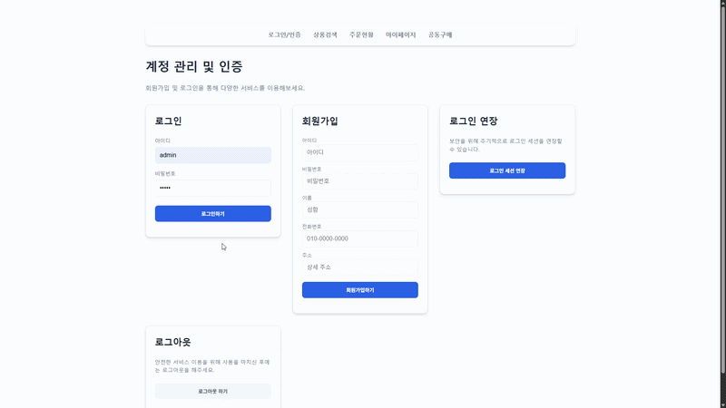

---


### 1. 프로젝트 개요
```markdown
# Ecommerce Backend System

본 프로젝트는 **H&M Personalized Fashion Recommendations Kaggle Dataset**을 기반으로 구축된 가상의 이커머스 백엔드 시스템입니다.  
회원, 상품, 주문, 인증 등 이커머스 핵심 API를 개발하고, 데이터 기반 추천 시스템을 도입하여 비즈니스 가치 창출에 기여했습니다.  
대규모 트래픽을 안정적으로 처리하고, 유지보수가 용이한 확장 가능한 아키텍처를 목표로 했습니다.

- **서비스 URL**: https://www.ecommerce.p-e.kr/
- **GitHub Repository**: https://github.com/orgs/ecommerce-systems/repositories/
- **제작 기간**: 2025.11.03 ~ 2026.01.26
```

---

### 2. 핵심 성과 요약
```markdown
## 핵심 성과
- 데이터베이스 최적화: 검색 API 응답 속도 **8배 향상** (101ms → 12ms)
- 캐싱 전략 적용: CPU 사용량 (200 VU)	16.3%	12.1% (25% 감소)
- 추천 모델 개발: Baseline 대비 **10배 이상** 성능 확보
- 시스템 안정성 확보: Redis 도입으로 부하 테스트 에러율 **0.64% → 0%**
- 고가용성 아키텍처: Scale-out 구조 및 Stateless 아키텍처 구현
```

---

### 3. 주요 기술 과제 및 해결 경험
```markdown
## 주요 기술 과제 및 해결 경험

### 1. 검색 성능 최적화
- **Challenge**: 다중 테이블 조인으로 인한 Latency (101ms)
- **Action**: CQRS 패턴 + 역정규화 테이블 + 복합 인덱스 적용
- **Result**: 평균 응답 속도 **12.6ms** (8배 개선)

### 2. API 응답 속도 극대화
- **Challenge**: 반복적인 DB 조회로 인한 Latency
- **Action**: 캐싱 전략 적용 (추천 결과 메모리 저장)
- **Result**: 응답 속도 **210ms → 6ms (35배 개선)**

### 3. 인증 시스템 안정성 확보
- **Challenge**: RDB 기반 인증 Race Condition, 에러율 0.64%
- **Action**: Redis 기반 Stateless 아키텍처 + JWT
- **Result**: 에러율 **0%**, 응답 속도 **3.2배 개선**
```

---

### 4. 추천 시스템 성능 검증
```markdown
## 추천 시스템 성능 검증

- **모델**: Markov Chain 기반 추천
- **Baseline**: 인기 상품, 랜덤 추천
- **평가지표**: MAP, NDCG, MRR

| Model             | MAP@20 | NDCG@20 | MRR@20 |
|-------------------|--------|---------|--------|
| Transition Model  | 0.1052 | 0.1235  | 0.1189 |
| Popularity Model  | 0.0098 | 0.0153  | 0.0121 |
| Random Model      | 0.0012 | 0.0021  | 0.0015 |
```

---

### 5. 인프라 및 개발 문화
```markdown
## 인프라 및 개발 문화
- **고가용성 아키텍처**: Docker Swarm 기반 Scale-Out
- **CI/CD 자동화**: GitHub Actions + Docker
- **모니터링**: Prometheus, Grafana
- **코드 품질**: TDD, 상세 API 문서, UML 다이어그램
```

---

### 6. 향후 과제 및 기술 비전
```markdown
## 향후 과제 및 기술 비전
- **MSA 전환 준비**: CDC, 이벤트 기반 아키텍처 도입 검토
- **AI 기술 접목**: 추천 모델 고도화, LLM 기반 상품 검색
```

---

